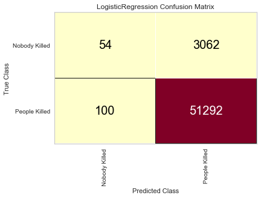
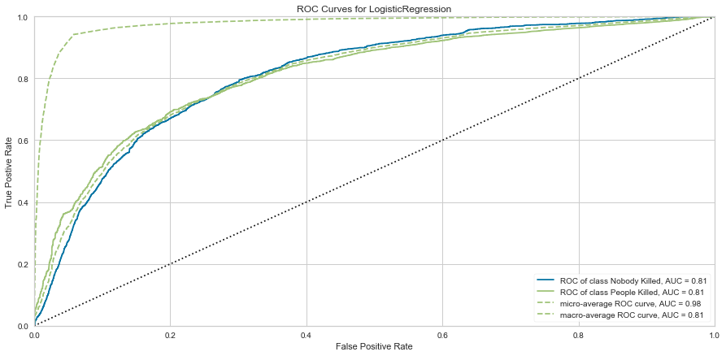

# Global Terrorism

## Introduction
 I chose to use data from the Global Terrorism Database (GTD) for this analysis.  This is an open-source database that includes information on terrorist attacks around the world from 1970 through 2017. My interests were to see if terrorist attacks are on the rise, what methods terrorists are using, locations of terrorist attacks, and preferred terrorist targets. 

## Data Sources Used
This project uses data from the Global Terrorism Database.  A copy of the data can be found [here](https://www.kaggle.com/START-UMD/gtd).  

## Technologies Used
* Python 3+
* Jupyter Notebook 5.7.8

## Required Packages  
```python
import pandas as pd
import matplotlib.pyplot as plt
import seaborn as sns
from yellowbrick.features import Rank2D
import descartes
import geopandas as gpd
from shapely.geometry import Point, Polygon
from wordcloud import WordCloud
import numpy as np
from sklearn.model_selection import train_test_split
from sklearn.linear_model import LogisticRegression
from yellowbrick.classifier import ConfusionMatrix
from yellowbrick.classifier import ClassificationReport
from yellowbrick.classifier import ROCAUC
```

## Analysis Methods Used  
* Python
* Exploratory Data Analysis
* Logistic Regression
* Graphical Analysis
* Confusion Matrix
* Receiving Operating Characteristic (ROC) Curve

## Model Deployment
We developed a logistical model that would predict if someone was likely to be killed in a terrorist attack.  The data were divided into two separate groups: people killed in a terrorist attack and people that survived a terrorist attack.     

## Summary of Results
Evaluation of our confusion matrix showed that that model was able to successfully predict 51,292 people out of a possible 51,392.  The ROC curve also indicated a good model fit.  Images of the confusion matrix and ROC curve are included below.
  

